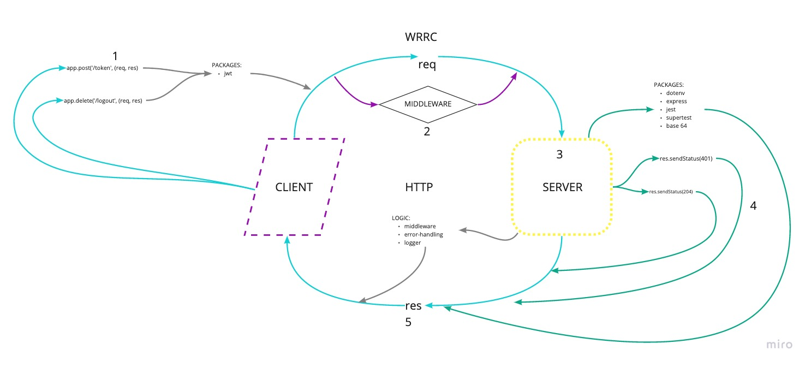

# Lab 06 - 401 JavaScript

## Basic Authorization

### Author: Jason Taisey

### Links and Resources

https://github.com/JTaisey389/bearer-auth/pull/1
TODO HEROKU

### Setup
- Clone down to your device
- In the root directory, run **npm install** to install node modules 
- Run **nodemon** to see your live server via local host in your browser

### Use 
- You can create a new account via the/signup route, then sign into the route with the /signin route. You can use [Swagger.io](https://inspector.swagger.io/builder)

### UML/WRRC 

### Contributions
- Pair Programed with [Lydia](https://github.com/LydiaMT/basic-auth)